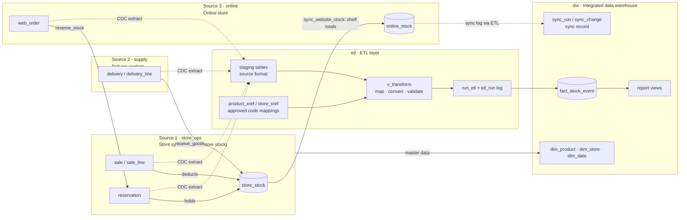
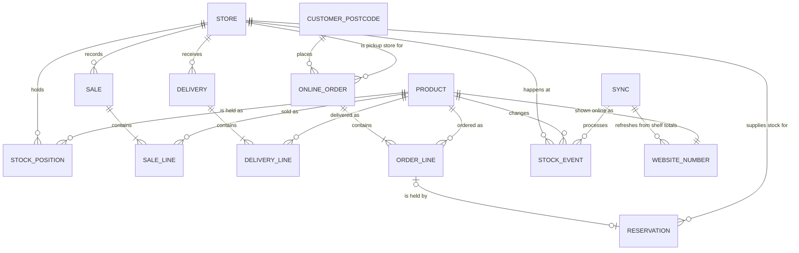
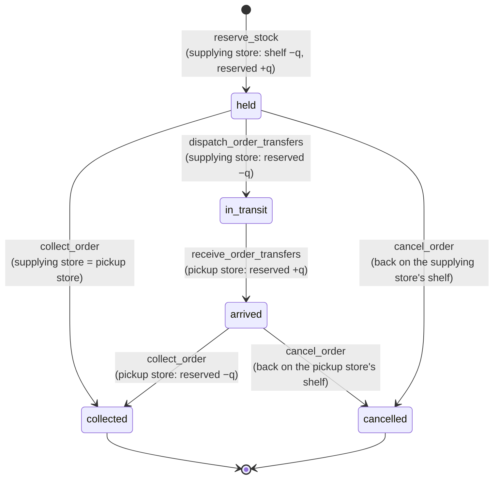
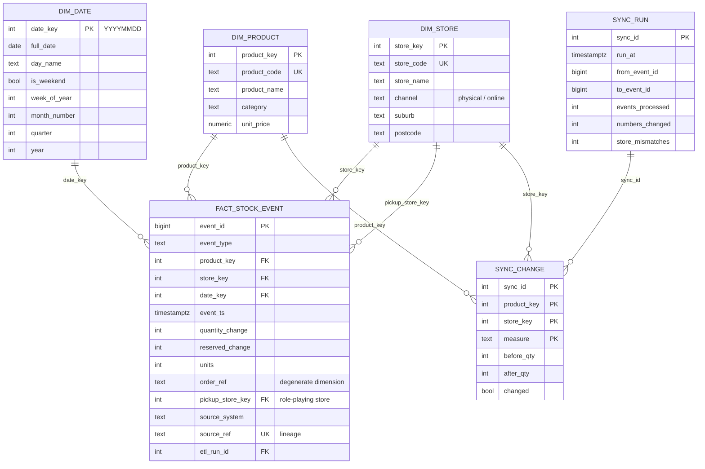

# PetHaven inventory prototype: architecture and data model

This document is the solution design behind the prototype in `workspace/`. It covers the architecture, the conceptual and logical data models, the ETL, the sync, the reports, and the reasons for the design and its trade-offs. Section numbers follow the report structure in the brief (section v. Solution Design, section vi. Prototype); [section 12](#12-mapping-to-the-assignment-brief) maps each brief item to the files that implement it.

- Business rules and scope: [Spec](../00_req_feedback/Assignment2_Spec.md)
- Rule → SQL → check mapping: [traceability.md](traceability.md)
- Verification results and limitations: [implementation_notes.md](implementation_notes.md)
- Live demonstration script: [demo_runbook.md](demo_runbook.md)

## 1. Problem in one paragraph

PetHaven has five Sydney stores and an online store. The website shows **one combined available quantity per product** for all five stores, but that number is only refreshed when a **sync** is run. Between syncs, in-store sales, supplier deliveries and store-side cancellations change the real stock without the website knowing. Customers therefore put items in their bag that the website says are in stock but no store can supply; checkout checks real stock **before payment** and blocks them, so the stale number costs a sale and the customer's trust instead of a cancelled paid order. It can also hide stock that is really there. The prototype integrates the three operational systems into one data warehouse, refreshes the website number on demand straight from the store system, and uses the warehouse to report how stale the website was, what each sync corrected, and which customers were affected. Operational systems talk to each other directly; the warehouse only records and analyses.

## 2. Solution architecture



| Layer | Schema | Responsibility | Not responsible for |
| --- | --- | --- | --- |
| Source 1 | `store_ops` | Stores, product catalogue, live shelf and reserved stock, till receipts, click-and-collect holds and transfers between stores | The website number; history across systems |
| Source 2 | `supply` | Delivery locations, supplier items, delivery dockets in cartons (UTC) | Store stock levels (it calls the store's receiving interface) |
| Source 3 | `online` | Web catalogue, website stock number, collection points, customer postcodes, online orders | Real store stock (it asks the store system to hold stock) |
| ETL | `etl` | Extract (CDC into staging), code cross-reference, transform, validate, load, run log, data quality | Business decisions; it never changes source data |
| Warehouse | `dw` | Conformed dimensions, the stock event fact, the online sync and its log, reports | Operating checkout or tills |

The lab runs all five schemas in one PostgreSQL 15 database. Each source schema stands for a separate system: no source table has a foreign key into another source, and the systems interact only through the small functions listed in [section 4.4](#44-how-the-systems-talk-to-each-other).

## 3. Conceptual model



| Entity | Meaning |
| --- | --- |
| Store | One of five physical shops. Also a click-and-collect point. |
| Product | One item PetHaven sells (food, treats, toys, accessories, health, aquatics). |
| Stock position | Units of one product at one store: **in store** (on the shelf, free to sell) and **reserved** (held for online orders). |
| Sale / sale line | A till receipt and its items. Reduces the shelf immediately. |
| Delivery / delivery line | A supplier docket and its items, in cartons. Increases the shelf immediately. |
| Online order / order line | A click-and-collect order from a customer postcode, with one line per product. Collected at the **pickup store** the customer chose from the stores holding at least one of the items. |
| Reservation | Stock held for one order line, taken from one store. If that store is not the pickup store, the units are **transferred**: held → in transit → arrived → collected (or cancelled). |
| Stock event | Any change to a stock position, from any system. The single history. |
| Sync | One manual run that refreshes the website numbers from the store system's shelf totals. The warehouse keeps a record of each one. |
| Website number | One combined available quantity per product, shown online. |

Definitions used everywhere:

- **Real combined available** for a product = sum of `in_store` over the five stores. Reserved units are not available.
- **Website number** = the shelf total at the last sync, minus the website's own paid orders since then.
- **Stale** = website number ≠ real combined available.
- **Blocked at checkout** = a bag item the website showed as in stock that no single store could supply when the customer checked out (before payment).

## 4. Source systems (logical model)

Each source has its own identifiers and conventions, as separate products from separate vendors would. The differences are deliberate: integrating them is the ETL's job.

| Concept | Store system (`store_ops`) | Delivery system (`supply`) | Online store (`online`) | Warehouse (`dw`) |
| --- | --- | --- | --- | --- |
| Store | `store_no` `101` | `location_code` `NSW-PARRA` | `cp_code` `CP-PARRAMATTA` | `store_code` `S01` |
| Product | EAN-13 `barcode` `9300601001019` (check digit enforced) | `supplier_sku` `PF-DOG-ADT-3K`, GTIN-14 | `web_sku` `WEB-10001` | `product_code` `P001` |
| Product name | "Adult Dry Dog Food Chicken 3kg" | "ADULT DRY DOG FOOD CHICKEN 3KG" | "Chicken Adult Dry Dog Food (3 kg)" | from store system |
| Quantity | units | **cartons** (× `units_per_carton`) | units | units |
| Time | `timestamptz` (Sydney) | **`timestamp` in UTC**, no zone | `timestamptz` | `timestamptz` + Sydney `date_key` |

### 4.1 Source 1 — store system (`store_ops`)

| Table | Key | Purpose |
| --- | --- | --- |
| `store` | `store_no` | The five stores (number, name, suburb, postcode). |
| `product` | `barcode` | Catalogue: description, category, shelf price. System of record for product attributes. |
| `store_stock` | `store_no, barcode` | **Live stock**: `in_store_quantity`, `reserved_quantity` (both ≥ 0). |
| `sale` | `sale_no` | Till receipt header: store, till, time. |
| `sale_line` | `sale_no, line_no` | Receipt items. A BEFORE INSERT trigger deducts the shelf and refuses the line if short, so the whole receipt fails. |
| `reservation` | `reservation_no` | Hold for one online order line: the store the units come from (`store_no`), the `pickup_store_no`, barcode, quantity, order ref and line, status `held` / `in_transit` / `arrived` / `collected` / `cancelled`, and the time of each step. |

Operations: `record_sale(store_no, barcodes[], quantities[])`, `receive_goods(...)`, `reserve_stock(...)`, `dispatch_order_transfers(order)`, `receive_order_transfers(order)`, `collect_order(order)`, `cancel_order(order, reason)`, `cancel_overdue_orders(days)` (housekeeping: cancels orders not collected within 3 days and puts the stock back), `stores_with_stock(...)`, `find_stock(...)`.

### 4.2 Source 2 — delivery system (`supply`)

| Table | Key | Purpose |
| --- | --- | --- |
| `location` | `location_code` | Delivery destination; `ship_to_store` is the store number printed on the docket. |
| `item` | `supplier_sku` | Supplier item: description, GTIN-14 of the retail unit, `units_per_carton`. |
| `delivery` | `delivery_no` | Docket: location, supplier, `delivered_at_utc`. |
| `delivery_line` | `delivery_no, line_no` | Items in cartons. A BEFORE INSERT trigger converts to units and calls the store's `receive_goods`. |

Operation: `record_delivery(location_code, supplier, skus[], cartons[])`.

### 4.3 Source 3 — online store (`online`)

| Table | Key | Purpose |
| --- | --- | --- |
| `product` | `web_sku` | Web catalogue: title, web price, `pos_barcode` used when asking a store to hold stock. |
| `online_stock` | `web_sku` | **Website number**: `available_quantity`, `last_synced_at`. |
| `collection_point` | `cp_code` | Pickup points with latitude/longitude and the store number. |
| `postcode_location` | `postcode` | Approximate centre of 20 Sydney postcodes. |
| `basket` / `basket_item` | `basket_id` / `basket_id, web_sku` | The customer's bag: postcode, status `open` / `checked_out`; each item with the website number shown when it was added. |
| `checkout_attempt` / `checkout_attempt_item` | `attempt_no` / `attempt_no, web_sku` | Each press of "checkout": pickup collection point, outcome `paid` / `blocked`, order created; per item the website number at checkout, `available` / `unavailable`, and the store that would supply it. |
| `web_order` | `order_no` | A **paid** order, one per checked-out bag: customer postcode, **pickup collection point**. |
| `web_order_line` | `order_no, line_no` | One product on the order: web SKU, quantity, website number shown, the collection point the units come from, store reservation number. |

Operations: `create_basket(postcode)`, `add_to_basket(basket, web_sku, qty)`, `remove_from_basket(basket, web_sku)`, `pickup_options(basket)`, `checkout(basket, pickup)`; `place_online_order(postcode, web_skus[], quantities[], time, pickup)` is a shortcut for all of them.

1. **Adding to the bag** is allowed only up to the website number — which may be stale. Nothing is held and the website number does not change. Bags never expire; an item that sells out later stays in the bag but blocks checkout.
2. **Pickup options.** The customer is offered every store that has at least one bag item (the whole quantity) on its shelf, ranked by fewest transfers, then distance from the customer (`online.pickup_options`). A store with none of the items is not offered. The customer picks one; if not, the top option is used.
3. **Checkout, before payment.** For each item the store system (`store_ops.find_stock`) finds the first store whose **real** shelf stock covers the whole quantity — the pickup store first, then the others by distance from it — and locks those stock rows, so whoever checks out first gets the stock and the answer cannot change during checkout.
4. **Any item unavailable → checkout blocked.** Nothing is charged or held, no order is created, the attempt records which items were unavailable, and the bag stays open so the customer can remove them and check out again.
5. **Everything available → paid.** The order is created and every item is held at its supplying store (`store_ops.reserve_stock`); items from another store are later **transferred** to the pickup store (section 4.5). Every held item lowers the website number immediately.

### 4.4 How the systems talk to each other

| Business action | Owner | Calls | Effect |
| --- | --- | --- | --- |
| Delivery recorded | Source 2 | `store_ops.receive_goods(store_no, barcode, units, time)` | Shelf + units, immediately |
| Checkout (stock check) | Source 3 | `store_ops.find_stock(barcode, qty, stores in preference order)` per item | Returns the supplying store and locks the rows; changes nothing |
| Checkout (paid) | Source 3 | `store_ops.reserve_stock(store_no, barcode, qty, order_ref, line_no, pickup_store_no, time)` per item | At the supplying store: shelf − qty, reserved + qty, immediately |
| Sync run | Warehouse | writes `online.online_stock` | Website number corrected |

These interfaces use the *receiving* system's codes (a delivery docket carries the store number and retail barcode; the website sends the store the barcode). They are operational routing data. The warehouse does **not** rely on them to integrate the sources; it uses its own approved cross-reference (section 5.2).

### 4.5 Click-and-collect lines and transfers between stores



Example (in the sample data, order 5): a Bondi customer orders 2 cat food, 2 dog beds and 4 scratching posts. The pickup options are Chatswood (has all three, no transfers) and Bondi Junction (has the cat food only); the customer chooses Bondi. Bondi holds the cat food. Bondi has 1 bed and 3 posts, so both lines are taken from Chatswood (the nearest store to Bondi with the whole quantity), dispatched, and — while in transit — belong to no store. When they arrive, Bondi holds them; the customer can collect only once **every** line is at Bondi. An order cannot be cancelled while a line is in transit.

## 5. ETL design (`etl`)

The ETL follows the extract → stage → transform/validate → load pattern from the subject (bronze/silver/gold with an audit log): staging tables are the raw layer, `etl.v_transform` is the cleaned layer, and `dw` is the business-ready layer.

### 5.1 Extract: change data capture into staging

Row-level AFTER triggers copy each new source record, **unchanged and in source format**, into one staging table per record type. Each staged row gets a unique `source_ref` (for example `SUPPLY:delivery 32 line 1`) and `load_status = 'pending'`.

| Source record | Staging table | Captured as |
| --- | --- | --- |
| `store_ops.sale_line` (+ header) | `stg_store_sale_line` | store number, barcode, quantity, sold time |
| `supply.delivery_line` (+ docket, item) | `stg_delivery_line` | location code, supplier SKU, **cartons**, units per carton, **UTC** time |
| `store_ops.reservation` insert / status change | `stg_reservation_change` | `held` / `in_transit` / `arrived` / `collected` / `cancelled`; the store where that step changed stock; the pickup store; barcode, quantity, order ref |
| `online.checkout_attempt_item` (+ attempt) | `stg_checkout_item` | basket, web SKU, quantity, pickup collection point, `available` / `unavailable` |

### 5.2 Transform: approved code cross-reference

`etl.product_xref` and `etl.store_xref` map each `(source_system, source_code)` to one conformed warehouse code. They are reference data maintained by a data steward (`etl.approve_product_mapping`), with `approved_by` and `approved_at`. A source code is matched **only** through an approved mapping. Matching by name or by the operational barcode fields is never attempted: names differ between systems by design, and a wrong guess would silently corrupt stock history.

`etl.v_transform` turns every staged row still to process into warehouse terms:

| Step | Rule |
| --- | --- |
| Codes | source store/product code → conformed `store_code`/`product_code` → surrogate `store_key`/`product_key` |
| Units | deliveries: `cartons × units_per_carton` |
| Time | deliveries: `delivered_at_utc AT TIME ZONE 'UTC'`; every event gets the **Sydney** business `date_key` |
| Event type | sale line → `store_sale`; delivery line → `delivery`; reservation held / in_transit / arrived / collected / cancelled → `reservation` / `transfer_out` / `transfer_in` / `collection` / `cancellation`; checkout item unavailable → `checkout_blocked` |
| Pickup store | order events also get `pickup_store_key` (role-playing store dimension) from the pickup store code |
| Signed quantities | from the event type (table in 6.2) |
| Skips | checkout items that were available get a `skip_reason`: no stock moved at checkout, and if the order was paid its stock movements come from the store reservations (loading both would double count) |

### 5.3 Validate: reject, never guess

A row gets a `reject_reason`, and is not loaded, when its product or store code has no approved mapping, the mapped product/store is not in the dimension, the quantity is not positive, the time is missing, or the date falls outside `dim_date`. Rejected rows stay in staging and are **retried on every ETL pass**, so they load as soon as the steward approves the mapping. They are visible in `etl.v_data_quality`, counted in `dw.rpt_online_staleness.source_rows_not_loaded`, and the gap shows up in the reconciliation report.

### 5.4 Load and scheduling

`etl.run_etl()` performs one pass: refresh dimensions (SCD type 1, only rows that changed), insert valid rows into `dw.fact_stock_event` in business-time order, mark each staged row `loaded` (with its `event_id`), `rejected` or `skipped` (with a note), and record counts in `etl.etl_run`.

A statement-level trigger on each source table runs one pass straight after the source statement, inside the same transaction (`trigger_source = 'cdc:<table>'`). This near-real-time micro-batch means the warehouse is never behind the stores. If the load fails, the source change rolls back with it, so the two can never disagree. The same function can be run by hand (`SELECT etl.run_etl();`) and is run at the start of every sync.

Idempotency and lineage: `source_ref` is unique in staging and in the fact table, so a source record is loaded at most once. Every fact row carries `source_system`, `source_ref` and `etl_run_id`.

## 6. Data warehouse (`dw`, logical model)



### 6.1 Dimensions

| Dimension | Rows | Notes |
| --- | --- | --- |
| `dim_product` | 18 (19 once P019 is approved) | Surrogate key + conformed `product_code`. Attributes from the store catalogue. SCD type 1. |
| `dim_store` | 6 | Five physical stores + `ONLINE` (channel `online`), used to label the website number in the sync log. |
| `dim_date` | 5,844 | 2020-01-01 to 2035-12-31, `date_key` = `YYYYMMDD` in Sydney time. |

### 6.2 Fact: `fact_stock_event`

**Grain:** one stock-changing event for one product at one physical store. It is a transaction fact table; current stock is the sum of its signed measures, so the table is also the complete audit trail.

| `event_type` | Source | `quantity_change` (shelf) | `reserved_change` | `order_ref` |
| --- | --- | ---: | ---: | --- |
| `store_sale` | till sale line | −units | 0 | – |
| `delivery` | delivery line | +units | 0 | – |
| `reservation` | line held at the supplying store | −units | +units | order |
| `transfer_out` | held units sent from the supplying store | 0 | −units | order |
| `transfer_in` | units arrive at the pickup store | 0 | +units | order |
| `collection` | collected at the pickup store | 0 | −units | order |
| `cancellation` | cancelled; units back on the shelf where they are | +units | −units | order |
| `checkout_blocked` | bag item no single store could supply at checkout (at the pickup store) | 0 | 0 | basket |

Every order event also carries `pickup_store_key`, a second, role-playing use of `dim_store` (where the customer collects), alongside `store_key` (where the stock changed). Between `transfer_out` and `transfer_in` the units are in no store, so store totals correctly exclude stock in transit.

The sign rules are enforced by the `ck_fact_signs` check constraint, and `ck_fact_order_context` requires `order_ref` and `pickup_store_key` together. `units` is always positive; for `checkout_blocked` it is the quantity in the bag that could not be supplied, and `order_ref` holds `basket <id>`. Indexes: `(product_key, store_key)` for stock totals, `date_key`, `event_type`, and a partial index on `order_ref`.

### 6.3 Sync log

`sync_run` is the warehouse's record of each website sync (linked to the online store's own log by `source_sync_no`) and the window of stock events since the previous one. `sync_change` records before/after: the `online_available` website number for every online product (from the sync log), and the store `in_store`/`reserved` totals changed in the window (from the fact history).

## 7. The sync (`online.sync_website_stock`) and its warehouse record

**Operations and analytics are kept apart.** The website number is an operational value, so it comes straight from the operational system that owns it; the data warehouse never sets it.

**The sync (operational, in the online store).** Run on demand only (`SELECT online.sync_website_stock();` or `demo.py sync`), so a presenter can make several changes first and then show the stale "before" and corrected "after" side by side. It:

1. Locks the website numbers so no checkout uses them mid-sync.
2. Asks the store system for the real shelf totals per product across the five stores (`store_ops.shelf_totals()`; reserved units are not available, so not counted), matched by the store barcode the online catalogue already holds.
3. Replaces each website number with that total and logs before/after in `online.stock_sync` / `stock_sync_line`.

**The warehouse record (analytical, via the ETL).** When the sync finishes, `dw.load_website_sync` (07_sync.sql) extracts its log into `etl.stg_website_sync_line`, maps web SKUs to warehouse products, and records in `dw.sync_run` / `dw.sync_change`:

- the website number before and after, per product;
- the stock events since the previous sync (the window `(previous to_event_id, current max event_id]`) and the store totals they changed, from the fact history;
- a reconciliation of the warehouse against the store system (`store_mismatches`, expected 0).

Reports 2 and 3 use this record to show how stale the website was and what each sync corrected. If the warehouse were down or a product's codes were not yet approved, the website number would still be right; only the reports would lag.

Between syncs the website changes only through its own paid orders (it knows those immediately). In-store sales, deliveries and store-side cancellations wait for the next sync, which is exactly the staleness the prototype demonstrates. Transfers do not change the website number: the units were already taken off it when the order was paid.

## 8. Reports

All in `dw`, as views, so they are always current:

| # | View | Question answered |
| --- | --- | --- |
| 1 | `rpt_current_stock_by_store` | What is on each shelf and held for collection, per store and product? Low-stock flag (≤ 2). |
| 2 | `rpt_online_staleness` | How long since the last sync, how many events are waiting, how many website numbers are wrong now, how many source rows failed to load? |
| 2 | `rpt_online_vs_actual` | For each product: website number vs real combined stock (overstated → oversell risk; understated → lost sales). |
| 2 | `rpt_last_sync_changes` | What did the last sync change (before → after)? |
| 3 | `rpt_checkout_blocked` | Which bag items did customers try to buy because the website showed them in stock, but checkout blocked before payment? For which pickup store, what did the website show versus what was really there, and why (stale number, or stock split across stores)? |
| 4 | `rpt_daily_sales` | Units sold per day, store, channel and category (roll-up through `dim_date`): in-store till sales at the selling store, and online sales (paid items less cancellations) at the pickup store. |
| 5 | `rpt_open_reservations` | Which click-and-collect order lines are still open, where are they coming from, are they waiting to be sent / in transit / ready, is the whole order ready, and which are overdue (> 3 days, cancelled by `store_ops.cancel_overdue_orders`)? |
| 6 | `rpt_reconciliation` + `etl.v_data_quality` | Does the warehouse agree with the store system, and which source records were rejected? |

Reports 1–5 read only the warehouse (plus the cross-reference for web SKUs). Report 6 deliberately compares the warehouse with Source 1.

## 9. Synthetic data

Created by `db/seed/01_reference_data.sql` and `02_business_history.sql`, through the sources' own operations so that every record passes through the ETL.

| Item | Content |
| --- | --- |
| Stores | Parramatta, Bondi Junction, Chatswood, Newtown, Penrith, each with codes in all three systems |
| Products | 18 mapped products in 9 categories with valid EAN-13 barcodes; P019 (cat tunnel) catalogued but deliberately unmapped |
| Postcodes | 20 Sydney postcodes with coordinates |
| History (7 days) | 90 opening-stock delivery lines (in cartons), 5 restock deliveries, 36 till sale lines on 28 receipts, 8 bags: 7 paid orders with 9 items (one overdue for collection, one 3-item order collected at the customer's chosen store with 2 items in transit from Chatswood) and 1 checkout blocked before payment by the stale website number; 2 collections, 1 cancellation, 2 syncs |
| Result | 155 staged source records → 146 fact rows + 9 skipped checkout items; 0 rejected; 90/90 store/product pairs reconcile; nothing pending |

Times are relative to the build day, so "time since sync" and "overdue" are always realistic.

## 10. Design rationale

| Decision | Why |
| --- | --- |
| One event fact table instead of balance snapshots | Every report and the sync need the same thing: stock changes over time. One history with signed measures gives current stock (sum), stock at any point (sum to an `event_id`), and a complete audit trail. |
| Different codes per source + approved cross-reference | Real systems from different vendors do not share keys. Conformed codes with surrogate keys keep the warehouse independent of source identifiers (as in the subject's surrogate-key pattern) and make integration explicit and auditable. |
| Reject-and-retry instead of guessing or failing | A guessed mapping corrupts stock silently; failing the business transaction would stop a till. Rejecting into staging keeps the source working, keeps the warehouse correct, and makes the gap visible until a person fixes it. |
| CDC + micro-batch ETL in the same transaction | The user requirement is that every sale, delivery and order is in the warehouse immediately, so the sync and reports never miss an event. Running the full extract-transform-load inside the source transaction guarantees source and warehouse cannot diverge, with no scheduler to run in the lab. |
| Staging in source format | Keeps the extracted evidence unchanged (cartons, UTC, source codes), so every transformation is visible and re-runnable. |
| Website number comes from the store system, not the warehouse | A data warehouse is for analysis. The number the website shows is operational and the store system already holds it, so the online store reads it there directly — as checkout does. The warehouse records each sync and reports on it, so analytics never sits in the path of trading. |
| Manual sync | The business problem is staleness. A manual trigger lets the demo build up a realistic stale state and show the correction on cue; a schedule would only change *when* it runs. |
| Website deducts its own orders immediately | The website knows its own sales. Only changes it cannot see (other channels, deliveries, store-side cancellations) need the sync. |
| One pickup store per order; missing lines transferred in from the nearest store that has them | Click-and-collect means one pickup location for the customer. Taking a missing line from the next-nearest store and transferring it keeps the order together instead of failing it, which is how multi-store retailers fulfil click-and-collect. |
| Check real stock at checkout, before payment | Taking payment and then cancelling is a poor customer experience and costs refunds. Checking and locking real stock inside checkout means a paid order can always be fulfilled; the stale website number now shows up as items blocked at checkout. |
| Block the whole checkout and let the customer edit the bag | The customer decides whether to buy the rest; nothing is charged for something that cannot be supplied. |
| Each item from one store | Keeps transfers simple (one shipment per item). |
| Views for reports | Always current, no refresh job, easy to open in CloudBeaver. Volumes are small. |
| PostgreSQL only | It is the lab's relational engine; the problem is relational and transactional. Neo4j and ClickHouse in the lab are not needed. |

## 11. Trade-offs and limitations

| Trade-off | Consequence | What a production system would do |
| --- | --- | --- |
| All five schemas in one database | Sources can call each other's functions and the ETL can run in the source transaction. Real systems would be separate databases. | Message/API integration between systems; log-based CDC (e.g. logical replication) into a separate warehouse database. |
| ETL inside the source transaction | Zero lag and no divergence, but every till sale also pays for an ETL pass. Measured at about 5 ms per pass (under 10 ms for a whole till sale) at this volume. | Asynchronous micro-batches every few seconds from a change log. |
| SCD type 1 dimensions | A price change rewrites history; `rpt_daily_sales` values sales at the current price. | SCD type 2 for product prices, or store the sale price on the fact. |
| Reports as views over the full fact | Simple and always current; cost grows with history. | Periodic snapshot fact for daily stock, partitioning by `date_key`, materialised views. |
| Each order item comes from one store | An item that only several stores together could supply (e.g. 2 beds, 1 at each of two stores) is blocked at checkout, reported with the reason "no single store had enough". | Split an item across several transfers. |
| The website number is still stale on the product page | Customers can add items that turn out to be unavailable at checkout — a lost sale and a frustrated customer, though never a cancelled payment. | Check real stock when the item is added to the bag too, or sync more often. |
| Only stores holding an item are offered for pickup | A customer cannot choose a store that has none of the items, even if it is closer. | Offer every store and transfer everything in. |
| Overdue orders are cancelled by a job someone runs | `cancel_overdue_orders` is manual, like the sync. | Run it on a schedule. |
| Transfers are instant to record | Dispatch and receive are explicit steps but have no courier, transit time or cost. | Transfer scheduling and transit-time estimates. |
| Manual sync | Staleness depends on someone pressing the button. | Scheduled or event-driven sync plus the same staleness report as an alert. |
| No returns, transfers between stores, stock adjustments | Not needed for the problem; out of scope. | Additional event types with their own sign rules. |
| Distance by postcode centre | Approximate; ties broken by collection point code. | Geocoded addresses, travel time. |

## 12. Mapping to the assignment brief

| Brief item | Where |
| --- | --- |
| v.a Solution architecture | Section 2 |
| v.b Conceptual model | Section 3 |
| v.c Logical model | Sections 4 (sources), 5 (ETL), 6 (warehouse) |
| v.d Design rationale | Section 10 |
| v.e Design trade-offs | Section 11 |
| vi.a Source databases and schemas (≥ 3) | `workspace/db/02_store_ops.sql`, `03_supply.sql`, `04_online.sql` |
| vi.b Integrated data warehouse (≥ 1) | `workspace/db/05_warehouse.sql` (+ `07_sync.sql`) |
| vi.c SQL scripts: create, extract, transform, load, synthetic data | `01_schemas.sql`; `06_etl.sql` (extract → transform → validate → load); `seed/01_reference_data.sql`, `seed/02_business_history.sql` |
| vi.d Reports (≥ 3) | `workspace/db/08_reports.sql` (6 reports) |
| vi.e End-to-end testing | `workspace/tests/check_demo.py` (95 checks), `workspace/demo/cloudbeaver_demo.sql`, [demo_runbook.md](demo_runbook.md) |

### File map

```text
workspace/db/01_schemas.sql             5 schemas
workspace/db/02_store_ops.sql           Source 1 tables, sale trigger, store operations
workspace/db/03_supply.sql              Source 2 tables, delivery trigger, record_delivery
workspace/db/04_online.sql              Source 3 tables, bag, checkout (stock check before payment), orders
workspace/db/05_warehouse.sql           dimensions, fact, sync log, indexes
workspace/db/06_etl.sql                 cross-reference, staging, CDC extract, v_transform, run_etl, data quality
workspace/db/07_sync.sql                load each website sync into the warehouse (dw.load_website_sync)
workspace/db/08_reports.sql             report views 1-6
workspace/db/seed/01_reference_data.sql master data and approved mappings
workspace/db/seed/02_business_history.sql  7 days of activity and 2 syncs
workspace/scripts/build.py              rebuild pethaven_demo
workspace/scripts/demo.py               demo commands
workspace/demo/cloudbeaver_demo.sql     the same demo as SQL statements
workspace/tests/check_demo.py           95 behaviour checks on pethaven_check
```
