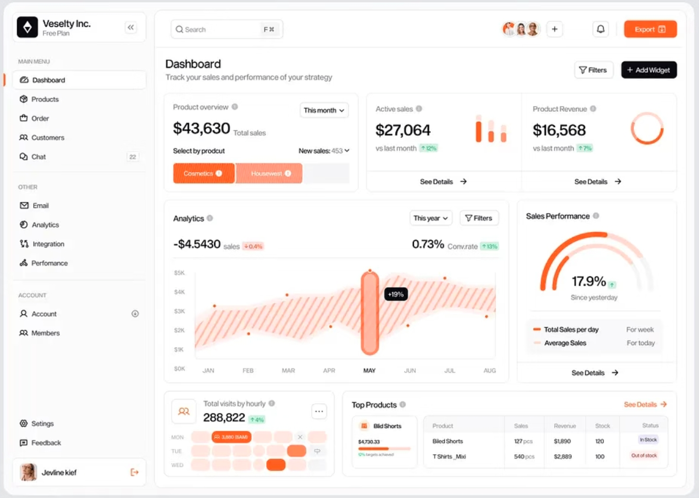
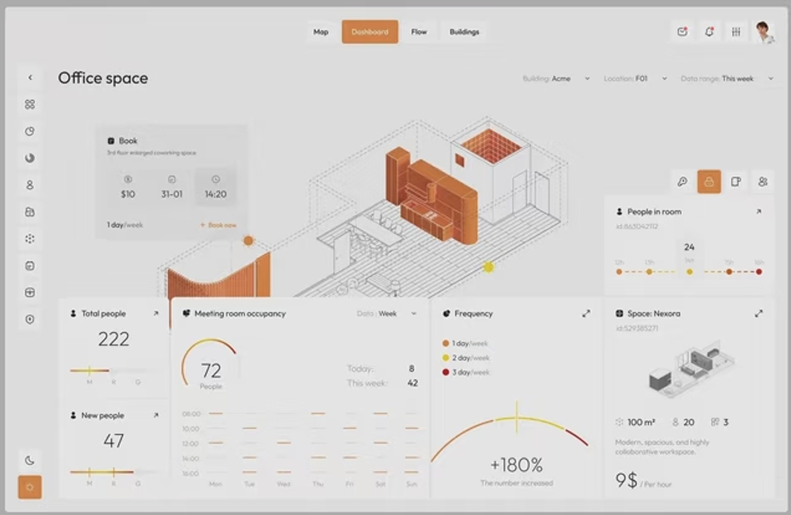

# PetHaven Dashboard — Implementation Specification

Version: 1.0 · 6 October 2026  
Audience: the implementation agent and project team  
Language: English for the application, code-facing documentation, and user messages  
Status: implementation brief; the dashboard and proposed HTTP endpoints are not yet built

## 1. Objective and scope

Build a working dashboard over the existing PetHaven PostgreSQL prototype. It must make the inventory synchronisation problem visible, show the result of the existing solution, and provide inspectable evidence of multi-source integration through the warehouse.

The delivered interface must answer four questions:

1. Does the website show the quantity that stores can actually supply?
2. Where is stock available or reserved, and which events explain it?
3. What happened when a customer tried to check out, and where are open orders in their fulfilment lifecycle?
4. How did source records become warehouse records, and can the resulting data be trusted?

Provide **three identifiable business reports, one integration/quality page, and a shared business-demo workspace**. Keep all analytical pages useful when the demo workspace is closed.

This is an educational working prototype using synthetic data. It is not a full ecommerce storefront, payment service, warehouse management system, or production monitoring platform.

### 1.1 Read these sources before implementing

- [Assignment requirements](../00_req_feedback/Assignment2_Requirements.md), especially Working Prototype Implementation items vi.a–e.
- [Tutor feedback](../00_req_feedback/29_Sep_tutor_workshop_feedback.md): focus on in-store/online product inventory synchronisation.
- [Business specification](../00_req_feedback/Assignment2_Spec.md): business rules, stock definitions, required reports, and demonstration cases.
- [Architecture and model](Architecture_and_Data_Model.md).
- [Implementation status and limitations](implementation_notes.md).
- [Existing demonstration runbook](demo_runbook.md) and [SQL demonstration](../workspace/demo/cloudbeaver_demo.sql).
- [Report view definitions](../workspace/db/08_reports.sql): executable SQL is authoritative for actual fields and calculations.
- [Lecture notes](../00_req_feedback/subject_knowledge/Notes_0-9.md), particularly Modules 1, 2, 5, and 8.
- [Workshop notes](../00_req_feedback/subject_knowledge/Notes_Workshop.md), particularly Workshops 2 and 6.

If a source comment contradicts executable SQL, inspect the implementation and describe the actual behaviour. Do not silently change the business model to make a screen easier to build.

### 1.2 Assignment and course traceability

The assignment asks for at least three source systems, at least one integrated warehouse, executable ETL scripts with synthetic data, at least three use-case reports/dashboard outputs, and an end-to-end testing video. It does not prescribe KPI cards or a particular web framework.

| Evidence needed | Dashboard implementation | Relevant learning |
| --- | --- | --- |
| Required report 1: stock by store | Store Inventory page | Fact/dimension joins; aggregation by product and store |
| Required report 2: online staleness and sync | Website & Sync page | Cross-system comparison; historical sync records |
| Required report 3: checkout blocks | Checkout & Fulfilment page, Blocked Items tab | Business-event history; integrated reporting |
| Three operational sources | Integration & Quality page and demo actions | Source systems versus warehouse versus consumption layer |
| Transformation and loading | A source-to-staging-to-fact trace | ETL; standardised identifiers, units, and dates |
| Validation and audit | Rejected records, ETL runs, reconciliation | Workshop 6 pipeline logging and validation |
| End-to-end prototype | Demo actions update the database and associated reports | Operational transactions followed by analytical consumption |
| Transaction outcomes | A blocked checkout leaves no successful order or partial reservation | Atomic business operations; Module 8 transaction concepts |

Label the three report pages in their subtitles or help text so a reviewer can identify the assignment outputs. Page count itself is not the measure of quality. Each report must answer its own business question.

## 2. Existing capabilities versus new implementation work

### 2.1 Already implemented; reuse

- `store_ops`, `supply`, and `online` operational schemas.
- Approved source-code cross-references, staging tables, transformations, ETL triggers, loading functions, and logs in `etl`.
- `dw.dim_product`, `dw.dim_store`, `dw.dim_date`, and `dw.fact_stock_event`.
- Operational website sync and warehouse sync history.
- Current stock, online comparison/staleness, last-sync changes, blocked checkout items, daily sales, open reservations, and reconciliation views.
- Command-line/SQL demonstration and business-behaviour checks.

### 2.2 Work this brief requires

- Responsive frontend and a local backend connected to the lab database.
- Read-only API adapters over existing views and small supplemental queries.
- Product/event/checkout lineage queries and serialisation.
- A bounded set of mutation endpoints calling existing database functions.
- Demo forms, operation feedback, report refresh, and reproducible demonstrations.
- Visual QA, API/UI integration tests, setup instructions, and a dashboard demo runbook.

Do not claim these API endpoints or UI interactions already exist. New queries may join existing tables; new business tables or changes to stock rules are not required for this scope.

### 2.3 Required, secondary, and excluded work

**Required for the first release:** all four pages, existing open-reservation detail, source/fact lineage, the core sale/delivery/basket/checkout/sync demo, and the unmapped-product recovery demonstration.

**Secondary, after the required release works:** daily sales analysis; dispatch/receive/collect/cancel controls in the demo; historical sync-batch selection; CSV export; true concurrent-checkout visual demonstration.

**Excluded:** authentication/account management, memberships, grooming, profit or conversion metrics, demand forecasting, real payment integration, product CRUD, automatic replenishment, 3D shop models, geographical maps, drag-and-drop widgets, scheduled sync, and a database reset button.

Do not add an arbitrary "today's blocked checkouts" KPI. The required report displays actual blocked item records with their timestamps. Do not add charts simply to match the reference screenshots.

## 3. Business semantics that must remain correct

| Term | Required definition and presentation |
| --- | --- |
| Available units | `in_store_quantity`: shelf stock free to sell. Reserved stock is already excluded; do not subtract it again. |
| Reserved units | Stock held for an order at a store. Transfer-out stock is in transit and temporarily belongs to neither store's reserved balance. |
| Store on-hand | Available + reserved at that store. Do not describe a sum across stores as all physical stock including transit. |
| Website shown | Current `online.online_stock.available_quantity`; one combined quantity per product across all five stores. |
| Warehouse available | Available stock reconstructed from warehouse `quantity_change` events. Do not label it unquestionable real-time truth if source records were rejected or reconciliation fails. |
| Difference | Website shown − warehouse available, for the same product across all five physical stores. |
| Website higher/lower | Difference > 0 / < 0. Display plain-English labels, not an invented risk score. |
| Low stock | Available units ≤ 2 for a store-product pair, using the existing view. It is a fixed prototype rule, not a demand-based reorder point. |
| Blocked item | One unavailable item in a particular checkout attempt. Several items can belong to one attempt; one basket can have several attempts. |
| Paid | Successful checkout in the prototype. No actual payment processor or card transaction exists. |
| Overdue | Existing reservation report rule: more than three days since reservation. Do not change it to three days since arrival. |
| Online sales, if added | Paid reservation units less cancellation units, attributed to the pickup store, as defined in `rpt_daily_sales`. |

Additional rules:

1. An item enters a bag based on the website number. Adding to a bag does not reserve stock.
2. Checkout checks real source stock before creating a successful order. Each product line must be supplied entirely by one store; different lines can come from different stores.
3. A blocked checkout is a recorded business outcome, not a server crash. It creates no paid order or partial stock hold, and the bag remains open.
4. The two blocked-item reasons are combined-stock shortage and stock split across stores. Sync does not remove the single-store fulfilment constraint.
5. The website sync reads store-system shelf totals and updates the website. It does not use warehouse totals to operate the website.
6. The warehouse records the sync and analyses its effects. Source ETL currently runs through triggers within operational transactions; do not display invented background job progress.
7. `pending_events` means events since the last sync boundary. It is not a queue of failed/unloaded ETL records and does not mean every event will alter the website number.
8. `rpt_last_sync_changes` contains both website adjustments and store balance changes between syncs. Only `measure = 'online_available'` is a website correction. Store changes are not stock edits performed by sync.
9. `dw.sync_run.numbers_changed` counts changed measure rows, not distinct corrected website products. Do not relabel it as a product count.
10. Rejected and skipped staging rows are different. An available checkout item may be skipped because its stock movement is represented by a store reservation; skipped does not automatically mean failure.
11. Current stock has no reporting-period filter. Date filters apply to historical events, attempts, runs, or sales only.
12. Use `Australia/Sydney` for business dates and display. Respect daylight saving; do not use a fixed UTC+10 offset.
13. Adding an existing SKU to a bag sets that line's requested quantity; the current function does not increment it. Label the edit accordingly and return the actual resulting bag.
14. `etl.run_etl` returns NULL when there is nothing to process and creates no run-log row. Display `No pending records to process`; do not invent a successful run ID or treat this as a failure.

## 4. Visual direction

The user supplied the two images below as visual references. They specify style and colour, not feature requirements or business content.

- [Reference 01 — layout](dashboard-reference/reference-01-layout.png): persistent sidebar, white cards, thin borders, structured tables, generous spacing, a small number of accent actions.
- [Reference 02 — palette](dashboard-reference/reference-02-palette.png): warm grey surfaces, muted terracotta orange, calm typography, restrained visual density.





### 4.1 Interpretation

Combine the structure of Reference 01 with the softer palette of Reference 02. Use a light interface with white/near-white cards on a warm grey canvas. The result should look like a carefully organised inventory analytics product.

Keep the hierarchy and visual restraint. Do not reproduce the sample company name, fake avatars, chat, account controls, revenue cards, gauges, building floor plan, or decorative occupancy graphics. The references are low-resolution images; the tokens below are an intentional interpretation, not claimed exact pixel samples.

### 4.2 Colour tokens

```css
:root {
  --page-bg: #F3F2EF;
  --sidebar-bg: #FAF9F7;
  --surface: #FFFFFF;
  --surface-subtle: #F7F5F2;
  --border: #E4E0DA;
  --text: #242320;
  --text-secondary: #66615A;
  --text-muted: #777168;
  --accent: #C7773E;
  --accent-hover: #AD6030;
  --accent-soft: #F7E8DA;
  --accent-text: #84441F;
  --primary-action: #282622;
  --primary-action-text: #FFFFFF;
  --success: #35634C;
  --success-bg: #EAF2EC;
  --warning: #805817;
  --warning-bg: #FAF0D9;
  --danger: #A13E36;
  --danger-bg: #F8EAE7;
  --focus: #84441F;
  --chart-website: #C7773E;
  --chart-warehouse: #555A60;
  --chart-reserved: #B8ACA0;
}
```

- Use terracotta for active navigation, selected data, and the website chart series. Do not paint every number orange.
- Main mutation buttons can be charcoal with white text. Accent actions may use a pale orange background with dark orange text. Avoid small white text on the medium-orange fill unless contrast has been checked.
- Error, warning, and success states use both text/icons and colour. "Website lower" is informational; it is not a green success state.
- Confirm normal text contrast of at least 4.5:1 and visible focus/control contrast during implementation. Adjust a token if needed while preserving the warm palette.
- No gradients, frosted glass, neon colours, decorative animation, or heavy drop shadows.

### 4.3 Typography and geometry

- Font: `Inter, "Segoe UI", system-ui, sans-serif`; the system fallback must work without an external font request.
- Page title: 28–30 px, weight 600. Section title: 16–18 px, weight 600. Body/table text: 14 px. Supporting labels: 12–13 px.
- Use tabular numerals for quantities and dates. Right-align numeric table cells.
- Desktop sidebar: 224–240 px; topbar approximately 64 px.
- Main content padding: 28–32 px on desktop, 16 px on narrow screens.
- Spacing scale: 4, 8, 12, 16, 24, 32 px. Card gap: 20–24 px.
- Card radius: 14 px. Input/button radius: 8 px. Borders: 1 px using `--border`.
- Cards may have a very subtle shadow, e.g. `0 2px 8px rgba(36,35,32,.03)`.
- Table row height: approximately 44–48 px; subtle separators; no heavy vertical gridlines.
- Use a consistent locally served outline icon set, or labelled text controls. Every icon-only action needs an accessible name.
- Motion is limited to short state transitions, approximately 120–180 ms, and respects reduced-motion preferences.

### 4.4 Responsive behaviour

- At 1440 px and 1280 px: expanded sidebar; side-by-side chart and selected-product detail when space permits.
- Around 1024 px: narrower/collapsible sidebar; stack secondary detail below its chart.
- At 768 px and below: navigation drawer; one-column content; wrapped filters.
- At 375 px: readable page and working forms. Only genuinely wide tables may scroll horizontally within their own container.
- Never shrink desktop charts until labels are unreadable. Reflow them and reduce tick density.
- No horizontal scrolling of the whole page. Demo panels must not cover essential report content or trap keyboard users.

## 5. Information architecture and application shell

### 5.1 Navigation

Use the following order and labels:

1. **Website & Sync** — default landing page; required Report 2.
2. **Store Inventory** — required Report 1.
3. **Checkout & Fulfilment** — required Report 3 plus reservation detail.
4. **Integration & Quality** — solution evidence and validation.

Sidebar brand: **PetHaven**, with the small subtitle **Inventory data solution**.

Provide **Business demo** as a clearly labelled shared action. On desktop it opens a resizable or fixed-width side workspace with sufficient report space; on smaller screens use a dedicated full-width panel with a clear return action. Preserve report selection when it opens/closes.

### 5.2 Topbar and shared status

- Current page name or breadcrumb.
- Compact `Synthetic data · Lab prototype` label.
- `Refresh reports` button: read-only re-query; never performs sync or ETL.
- `Business demo` button.
- Data read timestamp, shown in Sydney time.

Show a concise warning above analytical content when ETL rejections or reconciliation mismatches are present: **Warehouse data may be incomplete. Review Integration & Quality.** Keep the individual results visible with their provenance.

Do not use a global date picker or global store picker. Their meaning differs between current website totals, store balances, event history, and pickup-store reports. Filters belong to the section whose data they affect.

### 5.3 Shared interaction rules

- Reflect useful page filters and selected identifiers in the URL when practical, so reload restores the view.
- Product selections may carry between the website and inventory pages. Label each remaining filter and provide `Clear filters`.
- Search uses existing product names and codes; it is local to product-related content, not a decorative global search.
- Load from the database on page entry and on explicit refresh. After a successful mutation invalidate related data and re-query it.
- Do not automatically sync when navigating, refreshing, or opening the app.
- Show loading, empty, disconnected, validation-error, and stale-request states distinctly.
- Prevent an older async response from replacing data for a newer filter selection.

## 6. Page A — Website & Sync

### 6.1 Purpose and hierarchy

Title: **Website & Sync**  
Subtitle: **Compare website availability with warehouse stock and inspect the latest sync.**

Desktop composition:

```text
Title / subtitle                                      Refresh | Business demo
Last website sync: timestamp   Report read: timestamp   Data quality: status

Product search | Category | All / Different / Website higher / Website lower

[ Website vs warehouse available — comparison chart ] [ Selected product ]
[ Complete product comparison table                                      ]

[ Latest website sync: changed website values, before -> after            ]
[ Collapsed: store balance changes between the previous and latest sync   ]
```

Do not add a top row of revenue, visitor, conversion, forecast, or blocked-today KPI cards. A short inline sentence such as `3 of 18 mapped online products differ` is allowed if derived from the current result and scoped clearly.

### 6.2 Current comparison

Data: `dw.rpt_online_vs_actual`; join `dw.dim_product` by product code if a category filter is needed.

Table columns:

| Label | Existing field |
| --- | --- |
| Product | `product_code`, `product_name` |
| Website shown | `online_shown` |
| Warehouse available | `actual_in_store` |
| Difference | `overstated_by` |
| Status | Map computed comparison to `Website higher`, `Website lower`, `Equal` |

Use signed differences, such as `+5`, `−3`, and `0`, with the unit `units` in the chart/column help. Do not average different product quantities or cancel positive/negative product differences into a misleading headline.

Default: all mapped online products, sorted by absolute difference descending then product code. Chart may show the first eight results, with `Showing 8 of N`; the table exposes all filtered rows. When all products are equal, show equal comparison bars and `All displayed products match` rather than an empty chart.

Chart: paired horizontal bars for website and warehouse values on the same zero-based units scale. Stable series colours; visible legend and labels; product names can wrap. A selected row/bar updates the product detail. The table remains a complete accessible alternative.

Selected-product detail: full name/code, two current quantities, plain-language difference, and `View stock by store`. If no selection exists, use the first displayed product. No product photo placeholder is required.

Do not offer a store filter on this comparison: the website number is a five-store total. Product detail can drill into store distribution without redefining that total.

### 6.3 Sync results

Data: `dw.rpt_last_sync_changes` filtered to `measure = 'online_available'`, plus the latest `dw.sync_run` record.

Show `Product | Website before | Website after | Change`. Title the section **Latest website sync**. Obtain the number of changed website products from these filtered rows, not `sync_run.numbers_changed`.

If a sync exists but no website quantity changed, show **The latest sync did not change any website quantities.** This is different from **No website sync has been recorded.**

A separate collapsed table may show `in_store`/`reserved` changes, labelled **Store balance changes between syncs** with this explanation: **These movements occurred through business operations; the sync recorded them.**

Keep historical before/after values tied to their sync ID. Current values can change again after sync; do not overwrite the historical record with today's comparison values.

Historical batch selection is secondary work: query `dw.sync_run`/`dw.sync_change` for the selected ID; the existing last-sync view cannot serve an older batch.

## 7. Page B — Store Inventory

Title: **Store Inventory**  
Subtitle: **Available and reserved units by store and product.**

### 7.1 Main report

Data: `dw.rpt_current_stock_by_store`.

Filters: physical store, product/category, product search, `Low stock only`. Show `Current balance` beside the table; no date filter on this section.

Table: `Store | Product | Category | Available | Reserved | On hand | Stock status`.

- Use the view's current balances; do not subtract reserved again.
- Label zero as `Out of stock`, positive values ≤ 2 as `Low stock`, and higher values as `Available`. Preserve the underlying existing threshold.
- The dimensional cross join contains zero-balance combinations. Do not silently hide them.
- If showing a stock matrix, it is a secondary view of the same data: products as rows, stores as columns, selected measure available/reserved, visible numbers in each cell.
- No aggregate chart that implies one unit of pet food is equivalent in value to one aquarium kit.

### 7.2 Selected product/store and event history

Selecting a product shows available and reserved units at each of the five stores. Selecting a store-product pair opens its event history below or in a detail panel.

Supplemental read-only query: `dw.fact_stock_event` joined to product/store/date dimensions.

Columns: `Event time | Event type | Available change | Reserved change | Units involved | Order/basket reference | Source reference`.

- Filter by selected product/store; optional event-date range belongs only to this history.
- Sort by `event_ts DESC, event_id DESC`, expose event ID in details.
- Event types have readable labels; retain raw codes in technical details.
- `checkout_blocked` has zero balance changes. Explain it as an outcome event, not stock consumption.
- `View data trace` opens Page D with the exact event ID/source reference.
- When joining store roles, distinguish the stock-holding store from the pickup store.

### 7.3 Optional daily sales analysis

After required work, add a separate `Sales history` subview using `dw.rpt_daily_sales`, with date, store, channel, and category filters. Use units sold as the default measure and the seed's populated period as the default range.

If exposing `sales_value_at_current_price`, label it **Sales value at current price**, not actual revenue or profit. Net online cancellations may yield negative daily units; do not clamp them to zero. A product-level filter requires a new fact-level query because this report is already grouped by category.

## 8. Page C — Checkout & Fulfilment

Title: **Checkout & Fulfilment**  
Tabs: **Blocked items** (default), **Open reservations**.

### 8.1 Blocked items

Main data: `dw.rpt_checkout_blocked`.

Table columns: `Attempted at | Basket | Product | Requested | Website shown then | Combined available then | Pickup store | Reason`.

Use historical values from the report. Do not join current stock and present it as stock at checkout.

Filters: event-date range, product, pickup store, reason. Default to all existing prototype history so the seeded historical blocked checkout is visible; do not default to today and hide it.

Readable reason labels:

- **Combined stock insufficient**.
- **No single store could supply the quantity**.

Do not describe every blocked item as caused by stale data. Show the exact report classification; also disclose reconstruction limits when warehouse records are incomplete.

Display `N blocked item records` if a count is helpful. Do not label it `N failed orders`, `N customers`, or `N checkout attempts`.

For a stable row key and exact drill-down, supplement the view query with `event_id`, `source_ref`, and `attempt_no` from the fact and `etl.stg_checkout_item` joined on event ID. The existing report does not expose a unique attempt identifier, and `basket` alone is insufficient.

### 8.2 Checkout detail

On selection, show the corresponding `online.checkout_attempt` and `online.checkout_attempt_item` records through the staging lineage:

- Attempt number and basket number.
- Outcome and time.
- Each item, requested quantity, and recorded `website_qty_shown`.
- Whether each item was available and its candidate source collection point.
- Order ID if successful; otherwise **No successful order created for this attempt**.

Label this section **Source checkout record**. The report reconstructs the historical website/combined values; the source checkout item contains the directly captured website snapshot. Do not silently replace one with the other. If they disagree, expose the discrepancy for investigation.

The combined available quantity is reconstructed from warehouse events preceding the blocked event. Do not invent a directly captured source snapshot or claim the schema stores historical per-store stock at each attempt.

### 8.3 Open reservations

Data: `dw.rpt_open_reservations`.

Table: `Order | Product | Units | Source store | Pickup store | Line status | Order ready | Waiting time | Overdue`.

Filters: pickup store, source store, status, `Overdue only`. Display current open lines without an arbitrary recent-date cutoff that would hide old overdue orders.

- Group expandable rows by order ID without losing line-level detail.
- `order_ready` is an order-level result supplied by the report. Do not recompute it from only the filtered visible lines.
- Distinguish `Waiting to be sent`, `In transit`, and `Ready for collection`.
- A zero-row response means **No open reservations**, not a data error.
- The latest fulfilment state comes from this report/reservation history; `online.web_order.status` is not a live fulfilment-status field.
- Lifecycle mutation controls, if added, belong in the Business demo workspace.

## 9. Page D — Integration & Quality

Title: **Integration & Quality**  
Subtitle: **Trace source records through ETL and verify warehouse completeness.**

### 9.1 Compact architecture strip

Show a compact labelled flow:

```text
Store operations    ─┐
Supplier deliveries ─┼─> Staging -> Map / convert / validate -> Warehouse -> Reports
Online store        ─┘
```

Also identify the separate operational path in a short caption: **Website sync copies available quantities from the store system to the online system; its log is recorded in the warehouse.**

This diagram is explanatory, not a graph database, live network monitor, or animated ETL progress display.

### 9.2 Code mappings

Product table from `etl.v_product_codes`: `Warehouse product | Product name | Store barcode | Supplier SKU | Web SKU`.

Store table from `etl.v_store_codes`: `Warehouse store | Store name | Store code | Delivery location | Collection point`.

Missing mappings show `Not mapped`; unavailable source participation shows `Not sold online` only when confirmed by the source catalogue. Do not assume every null means the same thing.

These mapping views start from warehouse dimensions. Unmapped P019 may not appear there before approval. It must still be visible in the rejected-record/source-detail flow. Do not "fix" that by guessing mappings from names.

### 9.3 Source-to-warehouse trace

Selecting a staging record or following `View data trace` opens one detail panel with:

1. **Source**: source system, source reference, relevant source-format fields.
2. **Staging**: staging table, ID, captured time, load status and note.
3. **Transformation**: source codes to approved unified codes, source quantity/units to warehouse units, source time to Sydney event date.
4. **Warehouse**: event ID, event type, product/store/date keys and labels, signed stock changes, ETL run ID, loaded time.

For a delivery, show actual values such as `5 cartons × 4 units/carton = 20 units` only when those values come from the selected record.

Important implementation detail: `etl.v_transform` exposes pending/rejected records, not all successfully loaded history. For a loaded record, use its retained staging fields and linked fact row. Label displayed conversion steps as derived from stored fields; do not require the loaded row to remain in `v_transform`.

For a rejected row, show the reason and leave the warehouse destination empty. For skipped rows, show the actual skip note. Never fabricate a fact record to make the diagram complete.

### 9.4 ETL runs and staging outcomes

Display a compact latest-run summary and a table from `etl.etl_run`: `Run ID | Trigger | Started | Finished | Read | Loaded | Rejected | Skipped`.

These are recorded results of completed runs. Counts of rejected rows across repeated runs must not be summed and labelled unique rejected records. The current rejected-record list comes from `etl.v_data_quality`.

Staging list from `etl.v_staging`: filter by source/status; table includes `Source | Reference | Status | Note | ETL run | Event ID | Captured at`.

Website sync staging is separate: `etl.stg_website_sync_line` is not included in `etl.v_staging` or `etl.v_data_quality`. Provide a labelled `Website sync records` subsection with its own status/note and sync linkage. Do not advertise a complete "all records" total while omitting that stream, or attach an invented ETL run ID to it.

### 9.5 Reconciliation and rejected records

Use `dw.rpt_reconciliation` for the current source-versus-warehouse comparison. Show `Matching pairs / Compared pairs` and a table for all non-match rows.

Mismatch columns: `Store source code | Product source code | Unified store/product, if mapped | Source available | Warehouse available | Source reserved | Warehouse reserved | Status`.

- Preserve null/unmapped distinctions. Do not render every missing warehouse row as a confidently verified zero.
- Empty mismatch list means all compared pairs match; state the comparison scope.
- No comparison rows means unavailable/no data, not 100% success.
- Keep rejection and reconciliation sections separate: they answer different questions and their counts need not match.
- Clicking a rejection opens its staging trace and, for the supported P019 demo, its mapping-recovery workflow.

## 10. Business demo workspace

### 10.1 Behaviour

Label clearly: **Business demo — writes to pethaven_demo**. Default application loading is read-only. Opening the workspace alone does not change data.

Provide small forms using real catalogue options. Show warehouse-friendly codes in selectors and the resolved source codes as secondary details. Unmapped-product demonstration selectors must also support actual source codes.

Every submitted action returns the actual database-generated identifier and a concise result, followed by `View affected report` and `View data trace` where applicable. Do not use fixed order/basket/run IDs copied from comments in the old SQL demo.

Disable repeated submission while an action is pending. Do not automatically retry writes after a timeout: the transaction may already have committed. Explain an unknown outcome and allow the user to inspect recent records before repeating it. For the local single-presenter prototype, an in-flight guard and explicit inspection are the minimum; do not promise exactly-once delivery without a persisted design.

Ordinary sale/delivery/checkout/sync submits need no extra confirmation after the user has filled the form and pressed its labelled action. Keep a review step for approving a code mapping because it changes integration interpretation. No general-purpose SQL execution box or database rebuild endpoint.

### 10.2 Required operations

| Action | Inputs | Existing function(s) | Expected visible result |
| --- | --- | --- | --- |
| Record store sale | Store, one or more products, positive integer units | `store_ops.record_sale` | Receipt ID; shelf/fact changes; website may remain stale |
| Record delivery | Delivery location, supplier name, SKU, positive integer cartons | `supply.record_delivery` | Delivery ID; source cartons and converted units; updated shelf/fact |
| Create bag | Known customer postcode | `online.create_basket` | Generated basket ID; open bag |
| Add/update bag item | Basket, web SKU, positive integer quantity | `online.add_to_basket` | Actual bag content; no reservation |
| Remove bag item | Basket, web SKU | `online.remove_from_basket` | Updated bag |
| View pickup options | Basket | `online.pickup_options` | Actual offered collection points and transfer information |
| Checkout | Basket, offered pickup point or automatic selection | `online.checkout` | Generated order ID or recorded blocked attempt |
| Sync website stock | No quantity input | `online.sync_website_stock` | Source sync ID and linked warehouse sync ID; before/after website values |
| Approve demo mapping | Source system/code and P019 after review | `etl.approve_product_mapping` | Stored mapping; does not itself claim records have loaded |
| Run ETL | No raw SQL | `etl.run_etl` | Recorded run outcome, or a no-work result; rejected records may now load |

Before coding, inspect function signatures and use typed, parameterised SQL. Leave default event timestamps to the database in interactive operations. Source delivery time is UTC without time zone in its interface; handle it as that explicit source format.

`online.checkout` returning NULL for a blocked attempt is a normal committed result. **Do not roll it back**, or the evidence the report needs will disappear. Retrieve the exact new attempt for that basket within the operation, not a global maximum ID that could belong to another request.

Optional lifecycle actions call the existing `dispatch_order_transfers`, `receive_order_transfers`, `collect_order`, `cancel_order`, and `cancel_overdue_orders` functions. Preserve refused-operation feedback such as collecting before transfers arrive.

### 10.3 Mutation-to-report refresh map

| Mutation | Data to invalidate/re-read |
| --- | --- |
| Sale/delivery | Website comparison, store stock/events, staging/runs/reconciliation |
| Bag creation/edit | Bag and pickup options only; no optimistic stock change |
| Blocked checkout | Blocked items, source attempt, staging/runs |
| Successful checkout | Bag/order, stock, website comparison, open reservations, staging/runs |
| Website sync | Last sync, website comparison, sync staging/log, quality/reconciliation |
| Mapping approval + later ETL | Mappings, rejections, facts, affected stock/reconciliation, selector options |
| Transfer/collection/cancellation | Open reservations, stock/events, comparison, integration evidence |

Re-query after commit. Read refresh failures after a successful write must say **Action completed; report refresh failed**, not **Action failed**.

### 10.4 Required demonstration scenarios

Treat these as reproducible walkthroughs, not scripted browser animations. Verify prerequisites against the current database before presenting an action as runnable. Each scenario records its own returned identifiers. Scenario state may remain in the current browser session; it is not authoritative business data.

**A. Stale website stock affects checkout, then sync corrects it**

1. Use a mapped online product with positive shelf stock, preferably P018 after a clean build. Query current source balances and sync to establish an equal starting point.
2. Present an explicit scenario action, `Sell remaining available units`, showing which stores and quantities will be sold. On submission, call `record_sale` for each positive store balance of this one product in a single backend transaction. Do not directly overwrite stock. This bounded scenario consumes only this product's free stock, not reserved units.
3. Verify combined shelf availability is now zero and the website still shows its prior positive quantity.
4. Create a new bag, add one unit, and check out using the existing automatic selection behaviour. Confirm a blocked attempt, no successful order, and no additional reservations caused by this attempt.
5. Show the new blocked-item record and its lineage.
6. Run website sync; show website before > 0 and after = 0.
7. In a new bag, attempting to add one unit is now refused by the website-quantity check. This is an add-to-bag refusal, not another blocked checkout record.

If the product is already out of stock, explain the unmet prerequisite and suggest a valid product or an explicit delivery. Never silently rebuild or manufacture balances. A labelled scenario preparation/commit is allowed; unrequested background business changes are not.

**B. Supplier format becomes warehouse data**

1. Deliver P001 to Chatswood using supplier SKU `PF-DOG-ADT-3K`, location `NSW-CHATS`, 5 cartons, after checking the source catalogue.
2. Show the stored `units_per_carton` (currently 4), hence 20 units, and UTC-to-Sydney timestamp/date handling.
3. Follow the new staging record to its loaded delivery event and updated store availability.
4. Show that the website may now display fewer units than the stores have; sync and inspect the actual change if demonstrating that direction.

**C. Unmapped record is rejected, then recovered**

1. Verify the clean fixture: P019 exists in source catalogues, supplier SKU `PP-CAT-TUNNEL`, store barcode `9300601001194`, and its STORE/SUPPLY mappings are absent. It is not sold online.
2. Record a delivery of 2 cartons to `NSW-PARRA`; optionally sell one unit using its source barcode. Source operations succeed.
3. Show the staging rejection reason and source-versus-warehouse gap.
4. Review and approve the SUPPLY and STORE mappings to P019 with the existing function.
5. Explicitly run ETL; show linked loaded facts, resolved current rejections, and corrected reconciliation.
6. Run ETL again and verify the same source references do not create duplicate facts.

If mappings were already approved, mark the scenario as already prepared/completed and direct the presenter to the documented manual clean-build workflow if a fresh rejection demonstration is needed. Do not delete approved mappings as an automatic reset.

**D. Existing reservation lifecycle, read-only minimum**

Show an open order with source store different from pickup store, its transfer status, line readiness versus whole-order readiness, and overdue status if available. Discover real order IDs from the current report. Lifecycle writes are secondary scope.

## 11. Data/query contracts and known implementation traps

### 11.1 Read endpoints: proposed contract

These routes are to be implemented; names may be adjusted consistently across backend, UI, tests, and documentation.

| Method/path | Data and required behaviour |
| --- | --- |
| `GET /api/health` | DB availability, configured demo DB, server time; no credentials |
| `GET /api/catalogue` | Mapped products/stores, relevant source catalogue options, known postcodes |
| `GET /api/website-stock` | Comparison, staleness, quality summary; product/category/status filters |
| `GET /api/sync/latest` | Sync metadata; website corrections separately from store interval changes |
| `GET /api/stock` | Current store-product balances; store/product/category/low-stock filters |
| `GET /api/stock/events` | Fact/dimension event details; scoped date filters and stable ordering |
| `GET /api/checkout/blocked` | Report fields plus stable event/attempt identifiers |
| `GET /api/checkout/attempts/{id}` | Exact source attempt/items and lineage context |
| `GET /api/reservations` | Current open lines and full-order readiness |
| `GET /api/integration/mappings` | Existing product/store code views |
| `GET /api/integration/staging` | Business-event staging rows and status filters |
| `GET /api/integration/sync-staging` | Separate sync stream with source/warehouse sync linkage |
| `GET /api/integration/runs` | Recorded ETL run rows |
| `GET /api/integration/quality` | Current rejected rows plus reconciliation results |
| `GET /api/integration/trace` | Whitelisted staging-table + row ID, or exact event ID; trace details |

Use a consistent JSON envelope, for example:

```json
{
  "data": { "rows": [] },
  "meta": {
    "read_at": "2026-10-06T14:30:00+11:00",
    "timezone": "Australia/Sydney",
    "database": "pethaven_demo",
    "scope": "All five stores; mapped online products",
    "provenance": ["dw.rpt_online_vs_actual"],
    "warnings": []
  }
}
```

The timestamp above illustrates format only. Generate it for the actual response. Serialise big integer identifiers as strings to avoid JavaScript precision loss. Quantities in this prototype can be numeric; intervals should have explicit numeric seconds and/or a display string rather than opaque Python objects. Preserve nulls.

Paginate long event/staging/run lists, default 50 rows and a bounded maximum such as 200. Return total and page/cursor information. Whitelist sorting columns and source-table identifiers. Never pass an arbitrary client table name or SQL fragment into a query.

### 11.2 Mutation endpoints: proposed contract

Use POST routes such as `/api/demo/sales`, `/deliveries`, `/baskets`, `/baskets/{id}/items`, `/baskets/{id}/remove-item`, `/baskets/{id}/checkout`, `/sync`, `/mappings/approve`, and `/etl`, under the same `/api/demo` prefix. Pickup options and current bag reads use GET.

Support scenario A through one explicit, bounded endpoint that sells the selected product's current free stock using source functions, or an equivalent server-side scenario action. Validate and execute the preparation against one transactionally consistent set of balances; if state changes or a sale is refused, roll back that scenario action and explain why.

- Validate positive integer units/cartons, required fields, existing identifiers, and offered pickup choices.
- Missing field/invalid form: 400 or 422 with a readable message.
- Missing referenced entity: 404.
- Business refusal caused by current state: structured refusal, normally 409/422.
- Recorded blocked checkout: successful request with `outcome: "blocked"`, attempt ID and unavailable items; normally 200.
- DB unavailable: 503 with recovery guidance; no stack trace in the browser.
- Unexpected error: safe error ID/message and server-side diagnostic logging.
- No mutations through GET, no credentials in frontend code, no arbitrary SQL endpoint.

### 11.3 Consistency and transaction boundaries

- Each HTTP request owns its database connection/transaction. Never share one mutable psycopg connection across request threads.
- For a response with several related queries, use a short consistent read transaction/snapshot where needed. Do not claim multiple separately fetched pages are one atomic global snapshot.
- Commit a successful business function before refreshing analytical data. Roll back actual SQL failures and close/release the connection.
- Do not leave transactions open while waiting for browser input.
- Use existing sorted locking and reservation functions. Do not reproduce checkout allocation in JavaScript or bypass source validation with direct stock updates.
- Query the exact result generated by this request. Never associate operations by `MAX(id)` without request-specific scoping.

### 11.4 Provenance exceptions

Most report calculations come from warehouse facts. Two existing reports deliberately mix analytical and source data:

- `rpt_online_vs_actual` reads the live online quantity and compares it with warehouse-reconstructed availability.
- `rpt_reconciliation` compares live store source balances with warehouse balances.

Source checkout detail and demo forms also read operational records. Label provenance accurately. Do not advertise that every displayed value is read solely from `dw`, even though some existing comments describe Reports 1–5 that way.

Unmapped online products are not automatically included in the mapped comparison view. Qualify its scope and surface relevant sync-staging skips instead of assuming universal coverage.

## 12. Implementation structure and lab integration

### 12.1 Baseline approach

For this small prototype, use the existing Python 3.11 + psycopg2 lab runtime, a local HTTP server/API, and static HTML/CSS/JavaScript modules. Simple charts can use accessible SVG. This approach fits the existing environment without introducing a frontend build service.

A standard-library HTTP server is acceptable for this localhost educational prototype; do not describe it as production hosting. If an established frontend/backend already exists when implementation starts, reuse it if it satisfies this brief. Otherwise use the baseline rather than pausing to choose a framework.

Proposed files:

```text
workspace/dashboard/
  server.py                    # static serving and API routing
  queries.py                   # read queries, parameter binding, field adapters
  actions.py                   # wrappers around existing business functions
  serialization.py             # timestamps, IDs, intervals and error responses
  static/
    index.html
    styles.css
    app.js
    api.js
    components/
    pages/
    assets/                    # local icons/fonts if needed
  compose.dashboard.yml        # optional lab overlay, no replacement lab stack
workspace/tests/
  check_dashboard.py           # API/query integration checks using test DB
docs/
  Dashboard_Implementation_Spec.md
  dashboard_runbook.md         # actual startup, demonstration and verification
```

Reuse `workspace/scripts/pethaven_db.py` connection conventions and Sydney timezone handling. Application runtime targets `pethaven_demo`; tests use the existing isolated `pethaven_check` workflow. Do not build/rebuild the database on server startup.

### 12.2 Preserve the supplied lab files

Keep the root `docker-compose.yml`, `python/Dockerfile`, and `python/requirements.txt` unchanged for the baseline. Add an optional Compose overlay that gives the existing Python service an HTTP-server command and publishes an app port bound to host localhost, for example `127.0.0.1:8080:8080`.

Illustrative overlay shape, to be verified by the implementing agent:

```yaml
services:
  python:
    command: ["python", "/workspace/dashboard/server.py", "--host", "0.0.0.0", "--port", "8080"]
    ports:
      - "127.0.0.1:8080:8080"
```

Document a tested command from the repository root, such as:

```powershell
docker compose -f docker-compose.yml -f workspace/dashboard/compose.dashboard.yml up -d python
```

The mount path `/workspace` already exists. The backend uses hostname `postgres` inside the container and existing libpq environment overrides outside it. Do not require a cloud service, Railway deployment, external API, or hosted database.

Serve the frontend and API from the same local origin. Static file serving must be restricted to the static directory; do not expose environment files, database credentials, arbitrary filesystem paths, or directory listings. For write requests validate the local Host/Origin context and JSON content type; do not enable permissive cross-origin writes.

## 13. Empty states, feedback, and accessibility

| Situation | Required presentation |
| --- | --- |
| No sync yet | `No website sync has been recorded` and a link to the explicit demo sync action |
| All compared products equal | Positive informational state; keep the data visible |
| No latest website changes | Explain that the last sync changed no website quantities |
| No blocked items in a filter | `No blocked item records match these filters` with clear-filter action |
| No open reservations | `No open reservations` |
| No rejected rows | `No currently rejected business-event records`; do not imply sync staging was checked by the same view |
| Reconciliation mismatch | Visible caution and affected pairs; retain source and warehouse columns |
| Database unavailable | Error panel and `Retry`; no zero-filled charts or silent mock-data fallback |
| Business operation refused | Show the actual useful reason; preserve relevant form/bag state |
| Expected blocked checkout | Explicit `Checkout blocked` result and link to its recorded attempt |
| Optional historical value unavailable | `Unavailable` with reason; do not substitute current stock or zero |

Use semantic headings/tables/forms. Associate labels with fields, support keyboard selection and dismissal, return focus after closing panels, and announce action results accessibly. Essential values and explanations cannot depend on hover. Provide table equivalents for charts and visible legends/units. Avoid relying only on red/green or orange/grey to distinguish outcomes.

## 14. Acceptance and verification

### 14.1 Functional acceptance checklist

- [ ] Four pages exist with the specified navigation, English copy, and report identities.
- [ ] The three required reports read actual database data and are separately identifiable.
- [ ] Website comparison, store stock, blocked items, and open reservations agree with their source views for the same scope.
- [ ] No invented business KPI, fake data fallback, fixed demo order ID, or decorative chart is present.
- [ ] Current stock is unaffected by history-date filters; global website quantities are not compared with one selected store.
- [ ] Website sync and report refresh are distinct actions.
- [ ] Latest website corrections filter `online_available`; store interval changes are labelled separately.
- [ ] Blocked checkout commits its evidence, creates no paid order, and leaves no partial reservation.
- [ ] Repeated attempts from the same basket remain separately traceable.
- [ ] Open order readiness remains correct when only some lines are visible.
- [ ] Delivery trace displays stored cartons, conversion factor, units, and correct Sydney business date.
- [ ] Loaded lineage works after a row disappears from `v_transform`.
- [ ] Unmapped P019 is visible through rejection/source detail even before warehouse dimensions contain it.
- [ ] Approving mappings then running ETL loads previously rejected rows; rerun creates no duplicate facts.
- [ ] A no-work ETL call and setting an existing bag line's quantity match the actual function semantics.
- [ ] Separate website sync staging is visible or explicitly scoped out of business-event totals.
- [ ] Failed reads and valid zero/empty results look different.
- [ ] UI does not rebuild databases or change data on load/refresh/navigation.

### 14.2 Tests appropriate to this change

Run the existing business checks without replacing them:

```powershell
docker compose exec python python /workspace/tests/check_demo.py
```

The repository previously documented 95 passing checks; treat that as historical evidence, not the result of the new implementation. Report the actual new run outcome.

Add focused API/query integration checks against `pethaven_check` for:

1. View-equivalent stock/comparison values and correct sync measure filtering.
2. Parameter validation and refusal of unsupported dynamic query fields.
3. Sale/delivery effects through existing functions, with website unchanged until its prescribed update.
4. A committed blocked attempt, stable attempt/event identity, no partial reservation, and successful retry after editing a bag when applicable.
5. Source/staging/fact lineage for delivery and rejection recovery, including idempotent ETL rerun.
6. Empty/no-sync/disconnected states, date boundaries in Sydney, and immutable current-stock scope.

Do not run automated mutation tests on the user's working `pethaven_demo`. Do not claim that a sequential walkthrough proves concurrent isolation. A true concurrency demonstration, if added, needs independent database sessions and appropriate evidence.

### 14.3 Browser and visual QA

Inspect the running app at 1440×900, 1280×800, 768 px wide, and 375 px wide. Check all pages, product names, numeric columns, filter wrapping, demo forms, long rejection messages, empty states, and a keyboard-only route through the main actions.

At desktop size, the first viewport should establish the page question and show meaningful primary data. Secondary tables may continue below; do not shrink everything to fit one screenshot.

Capture at least:

- Website/warehouse mismatch before sync.
- Latest website corrections after sync.
- Store inventory with a selected product/event.
- A newly blocked checkout and its detail.
- Delivery source-to-fact trace.
- Rejected P019 records and their recovered state.

Screenshots are evidence from the running app with synthetic database data, not generated design mockups. Record actual test results and any remaining limitation in `dashboard_runbook.md`.

## 15. Suggested implementation sequence and handoff

1. Read the referenced code and business rules; preserve existing unrelated working-tree changes.
2. Implement the local server, DB adapters, shared layout, visual tokens, and read-only health/status handling.
3. Complete Website & Sync and Store Inventory using existing views.
4. Complete Blocked Items and Open Reservations, including stable attempt identity and details.
5. Complete Integration & Quality, especially retained staging/fact lineage and reconciliation.
6. Add the explicit demo mutations and report invalidation; verify the three core scenarios.
7. Run focused integration checks and the existing regression checks; perform browser/visual QA.
8. Write tested startup and demonstration instructions, capture evidence, and document limitations.

Final agent handoff must include the implemented files, the tested local launch command and URL, actual checks performed/results, and any unimplemented secondary features. Do not stop after a static visual shell. The required outcome is a connected dashboard that explains the business problem and demonstrates the existing database solution through real operations and query results.
